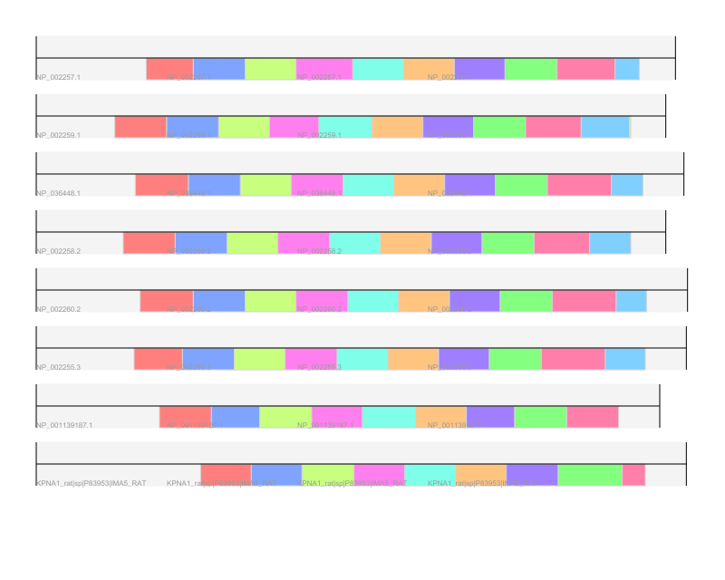

# Tral Visualization

Code for visualizing TRAL results.

## Installation

```
python setup.py install
```

The code is intended to be used with jupyter notebooks.

## Usage

There are two modules currently:

- `repeatdiagram` for displaying tandem repeats identified by TRAL
- `hmmlogo` for visualizing profile HMMs using the Skylign server

### Using repeatdiagram

```
from tralvisualizer.repeatdiagram import RepeatDiagram, show_hmm_state
```

For usage, see the example [Jupyter notebook](examples/repeatdiagram.ipynb). Unfortunately, github removes HTML formatting from results due to security conserns, so `show_hmm_state` output is not displayed correctly.

In brief, two types of output are supported. The `RepeatDiagram` class is used for visualizing TRAL RepeatList objects on one or more sequences.



The `show_hmm_state` function maps more detailed information about each repeat. It requires that each residue of a sequence be annotated with the repeat state.

Compact representation:


Detailed representation:


### Using hmmlogo

hmmlogo wraps the [Skyalign](http://skylign.org) server. If you use it, please cite

> Skylign: a tool for creating informative, interactive logos representing sequence alignments and profile hidden Markov models.
> Wheeler, T.J., Clements, J., Finn, R.D.
> BMC Bioinformatics Volume 15 (2014) p.7 DOI: 10.1186/1471-2105-15-7

The package is intended to be used in Jupyter notebooks. See the [example notebook](examples/hmmlogo.ipynb).
```
from hmmlogo import Skylign, get_pfam

logo = Skylign().get_logo("example.hmm")
```
This produces:

